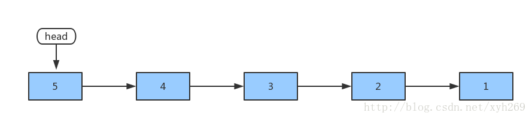
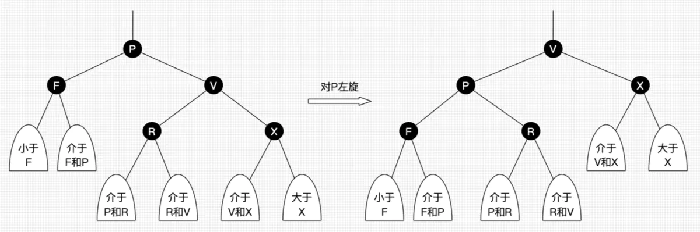
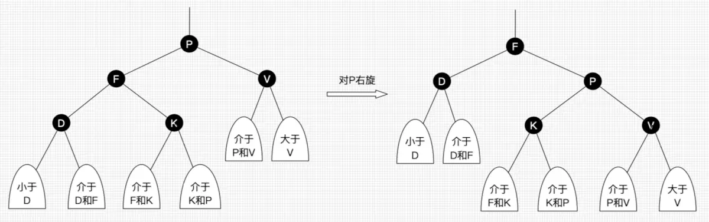

# 目录

[TOC]

# 一、算法学习笔记★

## 1、基础算法

### 快速排序

#### 1. 快速排序

【[AcWing 785](https://www.acwing.com/problem/content/787/)】

#### 2. 第k个数


### 归并排序

#### 1. 归并排序

【[AcWing 787](https://www.acwing.com/problem/content/789/)】

#### 2. 逆序对的数量

【AcWing】


### 二分

#### 1. 数的范围

#### 2. 数的三次方根


### 高精度

#### 1. 高精度加法

#### 2. 高精度减法

#### 3. 高精度乘法

#### 4. 高精度除法


### 前缀和与差分

#### 1. 前缀和

#### 2. 子矩阵的和

#### 3. 差分

#### 4. 差分矩阵


### 双指针算法

#### 1. 最长连续不重复子序列

#### 2. 数组元素的目标和


### 位运算

#### 1. 二进制中1的个数

### 离散化

#### 1. 区间和


### 区间合并

#### 2. 区间合并


### C++库函数实现

#### 1. memcpy和memmove的实现

- 当src和dst区域没有重叠时，两个函数是完全一样的。否则，memcpy是不能正常工作的，memmove是可以正常工作的。
- 使用(char \*)将(void\*)转换为char型指针，从而实现逐字节复制。

```c++
void * __cdecl memcpy ( void * dst,const void * src,size_t count)
{
   void * ret = dst;
   while (count--)
   {  // 注意， memcpy函数没有处理dst和src区域是否重叠的问题
      *(char *)dst = *(char *)src;
      dst = (char *)dst + 1;
      src = (char *)src + 1;
   }
   return(ret);
}
```

```c++
void * __cdecl memmove （ void * dst,const void * src,size_t count)
{
   void * ret = dst;
   if (dst <= src || (char *)dst >= ((char *)src + count))
   {  // 若dst和src区域没有重叠，则从起始处开始逐一拷贝
      while (count--)
      {
         *(char *)dst = *(char *)src;
         dst = (char *)dst + 1;
         src = (char *)src + 1;
      }
   }
   else
   {  // 若dst和src 区域交叉，则从尾部开始向起始位置拷贝，这样可以避免数据冲突
      dst = (char *)dst + count - 1;
      src = (char *)src + count - 1;
      while (count--)
      {
         *(char *)dst = *(char *)src;
         dst = (char *)dst - 1;
         src = (char *)src - 1;
      }
   }
   return(ret);
}
```


## 2、数据结构

### 链表与邻接表：树与图的存储

### 栈与队列：单调队列、单调栈

### kmp

### Trie

### 并查集

### 堆

### Hash表

### 树与图

#### 树与图的遍历：拓扑排序

#### 最短路

#### 最小生成树

#### 二分图：染色法、匈牙利算法

### C++ STL使用技巧


## 3、搜索

### DFS与BFS概述

深度优先搜索和广度优先搜索广泛运用于树和图中，但是它们的应用远远不止如此

**1、深度优先搜索 DFS**

- 数据结构：使用stack
- 空间：O(n)
- 不具有最短性
- DFS中有回溯、剪枝
- 适用于对空间要求比较高，比较复杂的题

典型案例：排列、N皇后

**2、广度优先搜索 BFS**

- 数据结构：使用queue

- 空间：O(2^n^)，空间为指数级，比DFS大很多

- 具有最短性

- 适用于找最短路径的题

  典型案例：迷宫问题 、二进制矩阵中的最短路径

  代码框架：

    ```C++
    void BFS()
    {
        queue<int> qu; // 定义队列
        vector<vector<int>> memo(m, vector<int>(n,0)); // 定义备忘录，用于记录已经访问的位置

        if(condition) return; // 判断边界条件，是否能直接返回结果

        qu.push(start); // 将起始位置加入到队列中
        memo[0][0] = 1; // 更新备忘录。

        while (!qu.empty()) {
            int cnt = qu.size(); // 获取当前队列中的节点个数
            while(cnt--) { // 遍历一层
                auto t = qu.front(); // 取队头
                qu.pop(); // 队头出队
                if(condition) { // 判断是否到达终点位置
                    // 某些输出或返回操作
                }
                // 根据某些条件获取下一层所有的节点
                if(condition) { // 条件判断，过滤掉不符合条件的位置
                    qu.push(); // 下一层节点入队
                }
            }
        }
    }
    ```

**3、对比**

- 两者均需标记已搜索过的点
- DFS的代码量相对BFS少一些
- DFS中第一句通常为递归边界（迷宫），或者返回值定义（红与黑）
- 路径点标记：
  - DFS中**仅有一处标记代码，不仅可标记起点，而且可标记新加入的点**
  - BFS中**有两处标记代码，先标记起点，加入新点时也需标记**
- 状态更新：
  - DFS中使用当前函数的输入参数更新状态
  - BFS使用队列中取出的参数更新状态
- 非法点判断：
  - 在DFS中标记起点前要进行合法性判断，此处**不仅可判断起点的合法性，也可以判断之后各点的合法性。加入新点时可不进行合法性判断**
  - 在BFS中标记起点前要进行合法性判断，但此处**仅能判断起点的合法性，之后加入新点的合法性要单独进行判断**

------

### BFS

#### 1. Flood Fill模型

##### 1、池塘计数

【[AcWIng 1097](https://www.acwing.com/solution/AcWing/content/5859/)】池塘计数，改编自Leetcode [733. 图像渲染](https://leetcode-cn.com/problems/flood-fill/)

农夫约翰有一片 N∗M 的矩形土地。最近，由于降雨的原因，部分土地被水淹没了。现在用一个字符矩阵来表示他的土地。每个单元格内，如果包含雨水，则用”W”表示，如果不含雨水，则用”.”表示。现在，约翰想知道他的土地中形成了多少片池塘。每组相连的积水单元格集合可以看作是一片池塘。每个单元格视为与其**上、下、左、右、左上、右上、左下、右下**八个邻近单元格相连。请你输出共有多少片池塘，即矩阵中共有多少片相连的”W”块。

> 输入格式：第一行包含两个整数 N 和 M。接下来 N 行，每行包含 M 个字符，字符为”W”或”.”，用以表示矩形土地的积水状况，字符之间没有空格。1≤N,M≤1000。
>
> 输出格式：输出一个整数，表示池塘数目。
>

```
输入
10 12
W........WW.
.WWW.....WWW
....WW...WW.
.........WW.
.........W..
..W......W..
.W.W.....WW.
W.W.W.....W.
.W.W......W.
..W.......W.
输出
3
```


**题解**：

方法1：使用BFS，好处是不会爆栈。每次找到一个池塘中的点，然后搜索周围的池塘点，并做标记。下次再搜索未标记的池塘点，所有池塘点搜索完即可获得连通的池塘个数。

```C++
#include <iostream>
#include <queue>

using namespace std;

const int N = 1010;
int m, n;
char g[N][N];
int st[N][N];
queue<pair<int, int>> qu;

void bfs(int x, int y) {
    qu.push({x, y});
    st[x][y] = 1;

    while(!qu.empty()) {
        auto t = qu.front();
        qu.pop();

        // 搜索周围的八个点
        for(int i = -1; i < 2; i++) {
            for(int j = -1; j < 2; j++) {
                int xx = t.first + i, yy = t.second + j;
                if(i == 0 && j == 0) continue; // 跳过当前所在点
                if(xx < 0 || xx >= m || yy < 0 || yy >= n) continue;
                if(g[xx][yy] == '.' || st[xx][yy] == 1) continue; // 跳过非池塘点及搜索过的点


                qu.push({xx, yy}); // 加入新点
                st[xx][yy] = 1; // 记录
            }
        }
    }
}

int main() {
    char c;
    cin >> m >> n;
    for(int i = 0; i < m; i++) {
        for(int j = 0; j < n; j++) {
            cin >> c;
            g[i][j] = c;
        }
    }

    int res = 0; // 连通区域计数
    for(int i = 0; i < m; i++) {
        for(int j = 0; j < n; j++) {
            if(g[i][j] == 'W' && st[i][j] == 0) { // 当前点是池塘中的点，并且没有搜到过
                bfs(i, j); // 从当前点开始搜索附近连通的区域，并标记搜索到的池塘点，保证下次搜到的池塘点属于另一片池塘
                res++; // 连通区域数量加1
            }
        }
    }
    cout << res << endl;

    return 0;
}
```


##### 2、城堡问题


##### 3、山峰和山谷


#### 2. 最短路模型

##### 1、迷宫问题

【[nowcoder](https://www.nowcoder.com/questionTerminal/cf24906056f4488c9ddb132f317e03bc?orderByHotValue=0&commentTags=C/C++) / [AcWing 1076](https://www.acwing.com/solution/AcWing/content/6692/)】定义一个二维数组N*M（其中2<=N<=10;2<=M<=10），如5 × 5数组下所示：   

```C++
int maze[5][5] = {  
    0, 1, 0, 0, 0,  
    0, 1, 0, 1, 0,  
    0, 0, 0, 0, 0,  
    0, 1, 1, 1, 0,  
    0, 0, 0, 1, 0,  
};
```

它表示一个迷宫，其中的1表示墙壁，0表示可以走的路，只能横着走或竖着走，不能斜着走，要求编程序找出从左上角到右下角的**最短路线**。入口点为[0,0],既第一空格是可以走的路。

```
输入两个整数，分别表示二位数组的行数，列数。再输入相应的数组，其中的1表示墙壁，0表示可以走的路。
数据保证有唯一解,不考虑有多解的情况，即迷宫只有一条通道。
5 5
0 1 0 0 0
0 1 0 1 0
0 0 0 0 0
0 1 1 1 0
0 0 0 1 0

输出左上角到右下角的最短路径
(0,0)
(1,0)
(2,0)
(2,1)
(2,2)
(2,3)
(2,4)
(3,4)
(4,4)
```

**题解**：求最短路径，必然使用广度优先搜索

```C++
#include <iostream>
#include <vector>
#include <queue>
using namespace std;

int m, n;
vector<vector<int>> maze; // 迷宫
vector<vector<int>> dis; // 到起点的距离
queue<pair<int, int>> loc; // 坐标
vector<vector<pair<int, int>>> path;

int bfs() {
    loc.push({0, 0}); // 初始化队列，放入起始坐标
    dis[0][0] = 0; // 标记起点距离
    
    int dx[4] = {-1, 0, 1, 0}, dy[4] = {0, 1, 0, -1};
    while(!loc.empty()) {
        auto t = loc.front();
        loc.pop();

        for(int i = 0; i < 4; i++) { // 四个方向
            int x = t.first + dx[i], y = t.second + dy[i];
            // 不是障碍物，并且没走过
            if(x >= 0 && x < m && y >= 0 && y < n && maze[x][y] == 0 && dis[x][y] == -1){
                dis[x][y] = dis[t.first][t.second] + 1; // 距离标记
                loc.push({x, y}); // 将可行坐标放入队列
                path[x][y] = t; // 记录之前走过的位置
            }
        }
    }
    
    // 从终点向前找之前走过的路径
    int x = m - 1, y = n -1;
    vector<pair<int, int>> tpath;
    tpath.push_back({x, y}); // 保存终点位置
    while(x || y) { // x、y不越界
        auto t = path[x][y]; // 获取前一位置
        tpath.push_back(t); // 保存前一位置
        x = t.first, y = t.second;
    }
    for(int i = tpath.size() - 1; i >= 0; i--)
        cout << '(' << tpath[i].first << ',' << tpath[i].second << ')' << endl;
    
    return dis[m - 1][n - 1];
}

int main() {
    while(cin >> m >> n) { // 处理多个case
        maze = vector<vector<int>>(m, vector<int>(n)); // 初始化迷宫
        dis = vector<vector<int>>(m, vector<int>(n, -1)); // 初始化距离标记
        path = vector<vector<pair<int, int>>>(m, vector<pair<int, int>>(n));
        for(int i= 0; i < m; i++){ // 输入迷宫
            for(int j = 0; j < n; j++) {
                cin >> maze[i][j];
            }
        }
        int minDis = bfs();
    }
    return 0;
} 
```


为便于输出路径，可从右下角开始搜索

```C++
#include <iostream>
#include <vector>
#include <queue>
using namespace std;

int m, n;
vector<vector<int>> maze; // 迷宫
vector<vector<int>> dis; // 到起点的距离
queue<pair<int, int>> loc; // 坐标
vector<vector<pair<int, int>>> path;

int bfs(int sx, int sy) {
    loc.push({sx, sy}); // 初始化队列，放入起始坐标
    dis[sx][sy] = 0; // 标记起点距离
    
    int dx[4] = {-1, 0, 1, 0}, dy[4] = {0, 1, 0, -1};
    while(!loc.empty()) {
        auto t = loc.front();
        loc.pop();

        for(int i = 0; i < 4; i++) { // 四个方向
            int x = t.first + dx[i], y = t.second + dy[i];
            // 不是障碍物，并且没走过
            if(x < 0 || x >= m || y < 0 || y >= n) continue;
            if(maze[x][y] != 0) continue;
            if(dis[x][y] != -1) continue;
            
            dis[x][y] = dis[t.first][t.second] + 1; // 距离标记
            loc.push({x, y}); // 将可行坐标放入队列
            path[x][y] = t; // 记录之前走过的位置
        }
    }
    
    // 从终点（左上角点）开始找之前走过的路径
    pair<int, int> end(0, 0);
    while(true) {
        cout << '(' << end.first << ',' << end.second << ')' << endl;
        if(end.first == m - 1 && end.second == n - 1) break;
        end = path[end.first][end.second];
    }
    return dis[m - 1][n - 1];
}

int main() {
    while(cin >> m >> n) { // 处理多个case
        maze = vector<vector<int>>(m, vector<int>(n)); // 初始化迷宫
        dis = vector<vector<int>>(m, vector<int>(n, -1)); // 初始化距离标记
        path = vector<vector<pair<int, int>>>(m, vector<pair<int, int>>(n));
        for(int i= 0; i < m; i++){ // 输入迷宫
            for(int j = 0; j < n; j++) {
                cin >> maze[i][j];
            }
        }
        int minDis = bfs(m - 1, n - 1); // 为便于输出路径，从终点开始搜索
    }
    return 0;
} 
```

##### 2、武士风度的牛


##### 3、抓住那头牛


#### 3. 多源BFS

##### 1、矩阵距离

【[AcWing 173](https://www.acwing.com/problem/content/175/)】给定一个由 0 和 1 组成的矩阵，找出每个元素到最近的 1 的距离。

改编自 [Leetcode 542. 01 矩阵](https://leetcode-cn.com/problems/01-matrix/)

```
输入样例：
3 4
0001
0011
0110

输出样例：
3 2 1 0
2 1 0 0
1 0 0 1
```

**题解**：

```C++
#include <iostream>
#include <cstdio>
#include <cstring>
#include <algorithm>
#include <queue>

#define x first 
#define y second

using namespace std;
const int N = 1010, M = N * N;

int dx[4] = {-1, 1, 0, 0};
int dy[4] = {0, 0, -1, 1};

int n, m;
char g[N][N];
int d[N][N];
queue<pair<int,int>> q;

void bfs()
{
    memset(d, -1, sizeof d);
    
    for(int i = 0; i < n; ++i)
        for(int j = 0; j < m; ++j)
            if(g[i][j] == '1')
                q.push({i, j}), d[i][j] = 0;
            
    while(!q.empty()) {
        auto t = q.front();
        q.pop();
        for(int i = 0; i < 4; ++i) {
            int nx = t.x + dx[i], ny = t.y + dy[i];
            
            if(nx < 0 || nx >= n || ny < 0 || ny >= m)  continue;
            if(d[nx][ny] != -1) continue;
            
            q.push({nx, ny});
            d[nx][ny] = d[t.x][t.y] + 1;
        }
    }
}

int main()
{
    scanf("%d%d", &n, &m);
    for(int i = 0; i < n; ++i)  scanf("%s", g[i]);
    
    bfs();
    
    for(int i = 0; i < n; ++i)
    {
        for(int j = 0; j < m; ++j)  printf("%d ", d[i][j]);
        puts("");
    }
    
    return 0;
}
```


#### 4. 最小步数模型

##### 1、八数码

【[nowcoder](https://www.nowcoder.com/questionTerminal/c958afdfd23b464fab907a2ba6d5f2a1?f=discussion) / [Acwing 845](https://www.acwing.com/problem/content/847/)】八数码问题，就是在一个含有1-8和x的3*3方格中，每次可以将x与其相邻位置（上下左右）的数字交换。

```
1 2 3
x 4 6
7 5 8
```

使得最后变成

```
1 2 3
4 5 6
7 8 x
```

交换过程如下：

```
1 2 3   1 2 3   1 2 3   1 2 3
X 4 6   4 X 6   4 5 6   4 5 6
7 5 8   7 5 8   7 X 8   7 8 X
```

你要做的就是实现八数码的解决方案，并要求**交换次数最少**。

```
输入一个3*3的矩阵，包含1-8和x
2  3  4  
1  5  x  
7  6  8
输出需要移动的步数，如果不可能实现，输出-1
19
```

**题解**：

可将每一种8数码当成图中的一个节点，通过广度优先搜索即可找到从一种8数码转换到另一种8数码的最短路径，每一种8数码表示一种状态，也即图中的一个节点。这道题的状态表示比较复杂，而且如何记录每个状态到初始状态的距离也是个问题。

状态表示：将9个格子展开，形成一个string以表示状态，如“123x46758”

各状态的距离：unordered_map记录当前的字符串和步数，如果string是目标状态，那么返回步数。

```C++
#include <iostream>
#include <unordered_map>
#include <string>
#include <queue>
using namespace std;

int bfs(string start) {
    string end = "12345678x"; //记录最后一个状态
    queue<string> qu;
    unordered_map<string, int> dis; // 存储当前状态到下一状态的距离
    
    qu.push(start); //将初始状态加入队列
    dis[start] = 0;
    
    int dx[] = {-1,0,1,0}, dy[] = {0,1,0,-1};
    while(!qu.empty()) {
        auto t = qu.front();
        qu.pop();
        
        int distance = dis[t];
        if(t == end) return distance;
        
        // 状态转移
        int k = t.find('x'); // 字符串表示中找x
        int x = k / 3, y = k % 3;  // 一维转化为二维
        for(int i = 0; i < 4; i++) {
            int xx = x + dx[i], yy = y + dy[i];
            if(xx >= 0 && xx < 3 && yy >= 0 && yy < 3) {
                swap(t[k], t[xx * 3 + yy]); // 二维转化为一维
                if(!dis.count(t)) { // 如果没有出现过当前状态
                    dis[t] = distance + 1;
                    qu.push(t);
                }
                swap(t[k], t[xx * 3 + yy]); //恢复现场
            }
        }
    }
    return -1; // 无法实现
}

int main() {
    string start;
    char c;
    for(int i = 0; i < 9; i++) {
        cin >> c;
        start += c;
    }
    cout << bfs(start) << endl;
    return 0;
}
```


##### 2、魔板


#### 5. 双端队列广搜

##### 1、电路维修


#### 6. 双向广搜

双向广搜适用于**已知终点**的情况，并且适用于**最小步数模型**这种要搜索的节点数量很大的情况，不适用于FloodFill及最短路模型这种节点数量较少的情况。

##### 1、字串变换

【[AcWing 190](https://www.acwing.com/problem/content/192/)】已知有两个字串 AA, BB 及一组字串变换的规则（至多6个规则）:

A1A1 -> B1B1

A2A2 -> B2B2

…

规则的含义为：在 AA 中的子串 A1A1 可以变换为 B1B1、A2A2 可以变换为 B2B2 …。

例如：AA＝’abcd’ BB＝’xyz’

变换规则为：

‘abc’->‘xu’ ‘ud’->‘y’ ‘y’->‘yz’

则此时，AA 可以经过一系列的变换变为 BB，其变换的过程为：

‘abcd’->‘xud’->‘xy’->‘xyz’

共进行了三次变换，使得 AA 变换为BB。

> 输入格式
>
> 输入格式如下：
>
> AA BB
> A1A1 B1B1 \
> A2A2 B2B2 |-> 变换规则
> … … /
>
> 所有字符串长度的上限为 20。
>
> 输出格式
>
> 若在 10 步（包含 10步）以内能将 AA 变换为 BB ，则输出最少的变换步数；否则输出”NO ANSWER!”
>

```
输入样例：
abcd xyz
abc xu
ud y
y yz

输出样例：
3
```

**题解**：使用双向广搜，相似题目：[Leetcode 127. 单词接龙](https://leetcode-cn.com/problems/word-ladder/)

```C++
#include <cstring>
#include <iostream>
#include <algorithm>
#include <queue>
#include <unordered_map>

using namespace std;

const int N = 6;

int n;
string a[N], b[N];


int bfs(string A, string B)
{
    queue<string> qa, qb;
    unordered_map<string, int> da, db;

    qa.push(A), da[A] = 0;
    qb.push(B), db[B] = 0;

    while (qa.size() && qb.size())
    {
        if(qa.size() > qb.size()) { // 保证扩展较短队列
            swap(qa, qb);
            swap(da, db);
            swap(a, b);
        }
        auto t = qa.front();
        qa.pop();
    
        for (int i = 0; i < t.size(); i ++ )
            for (int j = 0; j < n; j ++ )
            {
                if (t.substr(i, a[j].size()) != a[j]) continue;
                string r = t.substr(0, i) + b[j] + t.substr(i + a[j].size());
                if (db.count(r)) return db[r] + da[t] + 1;
                if (da.count(r)) continue;
    
                da[r] = da[t] + 1;
                qa.push(r);
        }
    }

    return 11;
}

int main()
{
    string A, B;
    cin >> A >> B;

    while (cin >> a[n] >> b[n]) n ++ ;

    int step = bfs(A, B);
    if (step > 10) puts("NO ANSWER!");
    else printf("%d\n", step);

    return 0;
}
```


#### 7. A*

##### 1、第K短路

##### 2、八数码


### DFS

DFS可分为两大类模型：

- **内部搜索**，即在一个网格/图的内部进行搜索，**不需要恢复现场**，如连通性问题。
- **外部搜索**，即在网格之间进行搜索，网格相当于图中的节点，**需要恢复现场**

DFS中：

- dfs函数开头通常需要进行**搜索终点判断**
- dfs函数开头还可能需要进行**合法性检查**
  - 在连通性模型（内部搜索）中合法性检查最好放在开头，而不是即将搜索下一点时，因为起点可能就是非法的。当然，两个地方都进行判断也是可以的
  - 其他模型（外部搜索）通常在即将搜索下一点时进行合法性检查
- dfs中可重复的资源不需要设置**备忘录**，否则需要。如小猫爬山问题中缆车可重复使用，不需要设置备忘录。在全排列问题中，每个数字仅能使用一次的话，就需要使用备忘录

------


#### 1. 连通性模型

用于FloodFill、树与图的遍历等，通常是在一个网格/图的**内部**，判断能否从一个点走到到另一个点。其余的DFS模型通常是在两个网格/图**之间**，判断能否从一种网格/图（状态）转换为另一种网格/图（状态）。

- 连通性模型中，**DFS用于判断能否从一个点走到另一个点，而BFS不仅能判断能否从一个点走到另一个点，还能得到最短距离**。例如迷宫问题，DFS仅能判断能否到达终点，而BFS还能计算到达终点的最短距离/路径。
- DFS相比于BFS代码较短，并且通常空间复杂度较低，但系统栈空间是1M，数据量大时会爆栈。
- 连通性模型这种在网格/图**内部搜索**的问题，不需要也**不能恢复现场，因为需要保证每个点搜索一次**。但其他模型中，把网格/图当成一种状态，需要判断能否从一种状态转变成另一种状态，此时需要把网格/图**恢复成原来的状态，才能够去搜索下一个分支**。

------

##### 1、迷宫

【[AcWing 1112](https://www.acwing.com/solution/AcWing/content/6788/)】一天Extense在森林里探险的时候不小心走入了一个迷宫，迷宫可以看成是由  n∗n  的格点组成，每个格点只有2种状态，`.`和`#`，前者表示可以通行后者表示不能通行。

同时当Extense处在某个格点时，他只能移动到东南西北(或者说上下左右)四个方向之一的相邻格点上，Extense想要从点A走到点B，问在不走出迷宫的情况下能不能办到。如果起点或者终点有一个不能通行(为#)，则看成无法办到。注意：A、B不一定是两个不同的点。

> 输入格式
> 第1行是测试数据的组数  k ，后面跟着  k  组输入。
>
> 每组测试数据的第1行是一个正整数  n ，表示迷宫的规模是  n∗n  的。
>
> 接下来是一个  n∗n  的矩阵，矩阵中的元素为.或者#。
>
> 再接下来一行是 4 个整数  ha,la,hb,lb ，描述  A  处在第  ha  行, 第  la  列， B  处在第  hb  行, 第  lb  列。
>
> 注意到  ha,la,hb,lb  全部是从 0 开始计数的。
>
> 输出格式
> k行，每行输出对应一个输入。能办到则输出“YES”，否则输出“NO”。
>
> 数据范围1≤n≤100 

```
输入：
3
3
.##
..#
#..
0 0 2 2
3
###
..#
#..
0 0 2 2
5
.....
###.#
..#..
###..
...#.
0 0 4 0

输出：
YES
NO
NO
```

**题解**：判断从起点是否可以走到终点，属于网格的遍历。此题既可使用DFS也可使用BFS，需要注意的是两者均需**对起点合法性进行判断**。

DFS和BFS对比：

- 两者均需标记已搜索过的点
- DFS的代码量相对BFS少一些
- DFS中第一句通常为递归边界，或者返回值定义（可见下一题：红与黑）
- 路径点标记：
  - DFS中`st[x][y] = 1;`不仅可标记起点，而且可标记新加入的点
  - BFS中先`st[x][y] = 1;`标记起点，加入新点时还需`st[x][y] = 1;`标记
- 状态更新：
  - DFS中使用当前函数的输入参数更新状态，例如`int a = x + dx[i], b = y + dy[i];`
  - BFS使用队列中取出的参数更新状态，例如`int a = t.first + dx[i], b = t.second + dy[i];`
- 非法点判断：
  - 可参考两种代码中`if(g[x][y] == '#')`语句的位置
  - 在DFS中在标记起点前进行第一处合法性判断：`if(g[x][y] == '#') return false;`**不仅可判断起点的合法性，也可以判断之后各点的合法性**，后面第二处合法性判断：`if(g[a][b] == '#') continue;`**可省略**
  - 在BFS中在标记起点前进行第一处合法性判断：`if(g[x][y] == '#') return false;`**仅能判断起点的合法性，之后各点的合法性也要进行合法性判断**：`if(g[a][b] == '#') continue;`**不可省略**

```C++
#include <iostream>
#include <cstring>
using namespace std;

const int N = 110;
int n;

char g[N][N];
int st[N][N];
int xa, ya, xb, yb;

int dx[] = {-1,0,1,0}, dy[] = {0,1,0,-1};

bool dfs(int x, int y) {
    if(x == xb && y == yb) return true; // 搜到终点了

    if(g[x][y] == '#') return false; // 先判断起点合法性，实际就是判断所有点的合法性
    st[x][y] = 1; // 标记搜过的点

    for(int i = 0; i < 4; i++) { // 枚举上下左右的点
        int a = x + dx[i], b = y + dy[i];
        if(a < 0 || a >= n || b < 0 || b >= n) continue;
        if(st[a][b]) continue; // 跳过搜过的点
        //if(g[a][b] == '#') continue; // 判断下一点合法性，若开头就判断合法性，此处可省略
        if(dfs(a, b)) return true; // 从一个合法点开始搜
    }
    return false;
}

#include <queue>
bool bfs(int x, int y) {
    queue<pair<int ,int>> qu;

    if(g[x][y] == '#') return false; // 先判断起点合法性
    qu.push({x, y});
    st[x][y] = 1; // 标记起点

    while(!qu.empty()) {
        auto t= qu.front();
        qu.pop();

        if(t.first == xb && t.second == yb) return true; // 找到终点

        for(int i = 0; i < 4; i++) { // 枚举上下左右的点
            int a = t.first + dx[i], b = t.second + dy[i]; // 注意与dfs的区别
            if(a < 0 || a >= n || b < 0 || b >= n) continue;
            if(st[a][b]) continue; // 跳过搜过的点
            if(g[a][b] == '#') continue; // 判断下一点合法性

            qu.push({a, b}); // 合法的点加入队列
            st[a][b] = 1; // 标记搜过的点
        }
    }
    return false;
}

int main() {
    int k;
    cin >> k;
    while(k--){
        cin >> n;
        for(int i = 0; i < n; i++) scanf("%s", g[i]);
        cin >> xa >> ya >> xb >> yb;
        memset(st, 0, sizeof(st));
        // DFS
        if(dfs(xa, ya)) puts("YES");
        else puts("NO");
        // BFS
//        if(bfs(xa, ya)) puts("YES");
//        else puts("NO");
    }
    return 0;
}
```


##### 2、红与黑

【[AcWing 1113](https://www.acwing.com/solution/AcWing/content/6394/)】有一间长方形的房子，地上铺了红色、黑色两种颜色的正方形瓷砖。你站在其中一块黑色的瓷砖上，只能向相邻（上下左右四个方向）的黑色瓷砖移动。请写一个程序，计算你总共能够到达多少块黑色的瓷砖。

> 输入格式
> 输入包括多个数据集合。
> 每个数据集合的第一行是两个整数 W 和 H，分别表示 x 方向和 y 方向瓷砖的数量。
> 在接下来的 H 行中，每行包括 W 个字符。每个字符表示一块瓷砖的颜色，规则如下
> 1）‘.’：黑色的瓷砖；
> 2）‘#’：白色的瓷砖；
> 3）‘@’：黑色的瓷砖，并且你站在这块瓷砖上。该字符在每个数据集合中唯一出现一次。
> 当在一行中读入的是两个零时，表示输入结束。
>
> 输出格式
> 对每个数据集合，分别输出一行，显示你从初始位置出发能到达的瓷砖数(记数时包括初始位置的瓷砖)。
>
> 数据范围1≤W,H≤20

```
输入样例：
6 9
....#.
.....#
......
......
......
......
......
#@...#
.#..#.
0 0
输出样例：
45
```

**题解**：属于FloodFill模型，计算连通区域中的点数

```C++
#include <iostream>
#include <cstring>
using namespace std;

const int N = 25;
int m, n;

char g[N][N];
int st[N][N];

int dx[] = {-1,0,1,0}, dy[] = {0,1,0,-1};

int dfs(int x, int y) {
    int cnt = 1; // 注意，每个点的cnt贡献为1

    if(g[x][y] == '#') return 0; // 合法性检查
    st[x][y] = 1;

    for(int i = 0; i < 4; i++) {
        int a = x + dx[i], b = y + dy[i];
        if(a < 0 || a >= m || b < 0 || b >= n) continue;
        if(st[a][b]) continue;
//        if(g[a][b] == '#') continue; // 合法性检查，可省略

        cnt += dfs(a, b);
    }
    return cnt;
}

#include <queue>
int bfs(int x, int y) {
    queue<pair<int, int>> qu;

    if(g[x][y] == '#') return 0; // 检查起点合法性
    qu.push({x, y});
    st[x][y] = 1;

    int cnt = 1;
    while(!qu.empty()) {
        auto t = qu.front();
        qu.pop();

        for(int i = 0; i < 4; i++) {
            int a = t.first + dx[i], b = t.second + dy[i]; // 注意与dfs的区别
            if(a < 0 || a >= m || b < 0 || b >= n) continue;
            if(st[a][b]) continue;
            if(g[a][b] == '#') continue; // 合法性检查

            qu.push({a, b});
            st[a][b] = 1;
            cnt++; // 记录加入的点数
        }
    }
    return cnt;
}

int main() {
    while(cin >> n >> m && m || n) {
        for (int i = 0; i < m; i++) cin >> g[i];

        int x, y;
        for (int i = 0; i < m; i++) {
            for (int j = 0; j < n; j++) {
                if (g[i][j] == '@') {
                    x = i;
                    y = j;
                }
            }
        }

        memset(st, 0, sizeof(st));
//        cout << dfs(x, y) << endl;
        cout << bfs(x, y) << endl;
    }

    return 0;
}
```


#### 2. DFS搜索顺序

##### 1、马走日

【[AcWIng 1116](https://www.acwing.com/solution/AcWing/content/6795/)】马在中国象棋以日字形规则移动。请编写一段程序，给定 n∗m 大小的棋盘，以及马的初始位置 (x，y)，要求不能重复经过棋盘上的同一个点，计算马可以有多少途径遍历棋盘上的所有点。

> 输入格式
> 第一行为整数 T，表示测试数据组数。每一组测试数据包含一行，为四个整数，分别为棋盘的大小以及初始位置坐标 n,m,x,y。
>
> 输出格式
> 每组测试数据包含一行，为一个整数，表示马能遍历棋盘的途径总数，若无法遍历棋盘上的所有点则输出 0。
>
> 数据范围
> 1≤T≤9,
> 1≤m,n≤9,
> 0≤x≤n−1,
> 0≤y≤m−1

```
输入样例：
1
5 4 0 0

输出样例：
32
```

**题解**：此题为外部搜索，即整个网格为一个状态，需要将整个网格当做图中的节点，在网格之间进行搜索，**需要恢复现场**

```C++
#include <iostream>
#include <cstring>
using namespace std;

const int N = 15;

bool st[N][N];
int res;
int n, m;

int dx[8] = {-1,-2,-2,-1,1,2,2,1}, dy[8] = {-2,-1,1,2,2,1,-1,-2};

void dfs(int x, int y, int cnt)
{
    if(cnt == m*n) { // 走了m*n步，即搜索到了所有的点
        res ++;
        return;
    }

    st[x][y] = true; // 标记

    for(int i = 0; i < 8; i++) {
        int a = x + dx[i], b = y + dy[i];
        if(a < 0 || a >= m || b < 0 || b >= n) continue;
        if(st[a][b]) continue;

        dfs(a, b, cnt + 1);
    }

    st[x][y] = false; // 需要恢复现场
}

int main() {
    int T;
    cin >> T;
    while(T--) {
        int x, y;
        res = 0;
        cin >> m >> n >> x >> y;
        dfs(x, y, 1);
        cout << res << endl;
    }

    return 0;
}
```


##### 2、单词接龙

【[AcWing 1117](https://www.acwing.com/solution/AcWing/content/6796/)】单词接龙是一个与我们经常玩的成语接龙相类似的游戏。现在我们已知一组单词，且给定一个开头的字母，要求出以这个字母开头的最长的“龙”，每个单词最多被使用两次。在两个单词相连时，其重合部分合为一部分，例如 beast 和 astonish ，如果接成一条龙则变为 beastonish。我们可以任意选择重合部分的长度，但其长度必须大于等于1，且严格小于两个串的长度，例如 at 和 atide 间不能相连。

> 输入格式
> 输入的第一行为一个单独的整数 n 表示单词数，以下 n 行每行有一个单词（只含有大写或小写字母，长度不超过20），输入的最后一行为一个单个字符，表示“龙”开头的字母。
>
> 你可以假定以此字母开头的“龙”一定存在。

> 输出格式
> 只需输出以此字母开头的最长的“龙”的长度。

> 数据范围
> n≤20

```
输入样例：
5
at
touch
cheat
choose
tact
a

输出样例：
23
提示
连成的“龙”为 atoucheatactactouchoose。
```


**题解**：

```C++
#include <iostream>
#include <string>
#include <algorithm>
#include <vector>
#include <cstring>

using namespace std;

const int N = 25;

vector<int> ver[N],edge[N];//匹配的单词编号和匹配长度

string word[N];

int n,res;

int st[N];

void dfs(string u,int k)
{
    st[k] ++;
    res = max(res,(int)u.size());

    for(int i=0;i<ver[k].size();i++)
    {
        int p=ver[k][i],d=edge[k][i];
        if(st[p]<2)
            dfs(u+word[p].substr(d),p);
    }
    st[k] --; // 恢复现场
}

int main() {
    cin >> n;

    for(int i=1;i<=n;i++)
        cin >> word[i];

    for(int i=1;i<=n;i++)
        for(int j=1;j<=n;j++)
        {
            string a = word[i] , b = word[j];
            int len = min(a.size(),b.size());
            for(int k=1;k<len;k++)
            {
                if(a.substr(a.size()-k)==b.substr(0,k))
                {
                    ver[i].push_back(j);
                    edge[i].push_back(k);
                    break;
                }
            }
        }

    string s;

    cin >> s;

    for(int i=1;i<=n;i++)
        if(s[0]==word[i][0])
            dfs(word[i],i);

    cout << res << endl;

    return 0;
}
```


##### 3、分成互质组


#### 3. DFS剪枝与优化

1. 优化搜索顺序

   优先搜索分支较少的节点

2. 排除等效冗余

3. 可行性剪枝

4. 最优性剪枝

------

##### 1、全排列

【[AcWing 823](https://www.acwing.com/problem/content/825/) / [力扣](https://leetcode-cn.com/problems/permutations/)】

**题解**：每个数仅能使用一次，因而需要备忘录。

```C++
#include <iostream>
using namespace std;

const int N = 10;
int n;
int path[N]; // 记录路径
bool st[N]; // 标记某层是否遍历过

void dfs(int u) {
    if(u == n) { // 遍历完所有层
        for(int i = 0; i < n; i++)
            cout << path[i] << " ";
        cout << endl;
        return;
    }
    for(int i = 1; i <= n; i++) { // 枚举当前位置可以使用的数，每个可使用的数会形成一条分支
        if(!st[i]){ // 找到一个当前层没有用过的数
            path[u] = i;
            st[i] = true; // 此数已使用
            dfs(u + 1); // 搜索下一层
            st[i] = false; // 恢复现场，接下来将遍历另一条路径，此数可重新使用，回溯
        }
    }
}

int main () {
    cin >> n;
    dfs(0); // 从第0层开始搜索
    return 0;
}
```


##### 2、N-皇后

【[Acwing](https://www.acwing.com/problem/content/description/845/) / [力扣](https://leetcode-cn.com/problems/n-queens/)】如何将 *n* 个皇后放置在 *n*×*n* 的棋盘上，并且使皇后彼此之间不能相互攻击。


方法1：可以分析出每行只能放一个皇后，因而可以枚举每一行的皇后放在哪个位置

```C++
#include <iostream>
using namespace std;

const int N = 10;
int n;
bool col[N], dg[N], udg[N]; // 记录选过的列，对角线，反对角线
char g[N][N];

void dfs(int u) {
    if(u == n) { // 遍历完所有行，即安排完所有皇后
        for(int i = 0; i < n; i++)
            cout << g[i] << endl;
        cout << endl;
        return;
    }
    for(int i = 0; i < n; i++) { // 枚举每行可以选择的位置
        if(!col[i] && !dg[i + u] && !udg[n - u + i]) { // 找到一个所在列未选择，正反对角线未选择的位置
            g[u][i] = 'Q';
            col[i] = dg[i + u] = udg[n - u + i] = true;
            dfs(u + 1); // 遍历下一行
            // 恢复现场
            col[i] = dg[i + u] = udg[n - u + i] = false;
            g[u][i] = '.';
        }
    }
}

int main () {
    cin >> n;
    for(int i = 0; i < n; i++) {
        for(int j = 0; j < n; j++)
            g[i][j] = '.';
    }
    dfs(0); // 从第0行开始搜索，即安排第1个皇后的位置
    return 0;
}
```

方法2：更加直接的方法，枚举每个格子，可能放皇后也可能不放皇后，复杂度高很多

```C++
#include <iostream>

using namespace std;


const int N = 20;
int n;
bool row[N], col[N], dg[N], udg[N]; // 记录选过的行，列，对角线，反对角线
char g[N][N];

// 行、列、当前已放置皇后数
void dfs(int x, int y, int s) {
    if(y == n) y = 0, x++; // 处理超过边界的情况
    
    if(x == n) { // 遍历完所有行，枚举完n^2个位置
        if(s == n) { // 已放置n个皇后，打印
            for(int i = 0; i < n; i++)
                cout << g[i] << endl;
            cout << endl;
        }
        return; // 枚举完所有位置，返回
    }
    
    // 不放皇后，搜下一个位置
    dfs(x, y + 1, s);
    
    // 放皇后
    if(!row[x] && !col[y] && !dg[x + y] && !udg[x - y + n]) { // 所在行列及正反对角线无皇后
        g[x][y] = 'Q';
        row[x] = col[y] = dg[x + y] = udg[x - y + n] = true;
        dfs(x, y + 1, s + 1); // 搜下一个位置，已放皇后数加1
        // 恢复现场
        row[x] = col[y] = dg[x + y] = udg[x - y + n] = false;
        g[x][y] = '.';
    }
}

int main () {
    cin >> n;
    for(int i = 0; i < n; i++) {
        for(int j = 0; j < n; j++)
            g[i][j] = '.';
    }
    dfs(0, 0, 0); // 从第0行0列开始搜索
    return 0;
}
```


##### 3、小猫爬山

【[AcWing 165](https://www.acwing.com/problem/content/167/)】翰翰和达达饲养了N只小猫，这天，小猫们要去爬山。经历了千辛万苦，小猫们终于爬上了山顶，但是疲倦的它们再也不想徒步走下山了（呜咕>_<）。翰翰和达达只好花钱让它们坐索道下山。索道上的缆车最大承重量为W，而N只小猫的重量分别是C1、C2……CN。当然，每辆缆车上的小猫的重量之和不能超过W。每租用一辆缆车，翰翰和达达就要付1美元，所以他们想知道，最少需要付多少美元才能把这N只小猫都运送下山？

> 输入格式
> 第1行：包含两个用空格隔开的整数，N和W。
> 第2..N+1行：每行一个整数，其中第i+1行的整数表示第i只小猫的重量Ci。
>
> 输出格式
> 输出一个整数，表示最少需要多少美元，也就是最少需要多少辆缆车。
> 数据范围
> 1≤N≤18,
> 1≤Ci≤W≤108

```
输入样例：
5 1996
1
2
1994
12
29

输出样例：
2
```

**题解**：此题使用dfs进行暴力搜索，每次安排一只猫，有两种情况：1、放到现有的缆车上  2、新加一辆缆车，放到新的缆车上。

需要注意的地方：此题中**不需要设置备忘录**，每次安排一只猫，每只猫均有可能放到任意一辆缆车上，即**缆车可以重复使用**

使用到的剪枝优化方法：

- 优化搜索顺序，先安排重量大的猫，可以减少需要判断的次数。比如一只猫比缆车承重量还大，那么直接不需要安排了
- 最优性剪枝，如果当前分支使用的缆车数量比之前方案使用的缆车数量还多，那么无需继续进行搜索
- 可行性剪枝，即跳过某猫加入缆车后超重的情况

```C++
#include <iostream>
#include <algorithm>

using namespace std;

const int N = 20;

int n, m; // 猫数量，缆车承重量
int sum[N], cat[N]; // 各缆车中猫的总重量，各猫的重量
int ans = N;

void dfs(int u, int k)
{
    // @最优性剪枝
    if (k >= ans) return; // 此方案不可能是最小的

    if (u == n) { // 分配完所有猫
        ans = k; // 已剪枝，此时k一定小于ans
        return;
    }

    // 在当前车中选一辆
    for (int i = 0; i < k; i ++ ) // 安排当前这只小猫可能放到哪辆车上
        if (sum[i] + cat[u] <= m) { // @可行性剪枝
            sum[i] += cat[u]; // 第u只小猫放到第i辆车上
            dfs(u + 1, k); // 安排下一只小猫，车数量不变
            sum[i] -= cat[u]; // 恢复现场
        }

    // 新开一辆车
    sum[k] = cat[u]; // 第u只小猫放到新开的第k辆车上
    dfs(u + 1, k + 1); // 安排下一只小猫，车数量加1
    sum[k] = 0; // 恢复现场
}

int main()
{
    cin >> n >> m;
    for (int i = 0; i < n; i ++ ) cin >> cat[i];

    // @优化搜索顺序
    sort(cat, cat + n);
    reverse(cat, cat + n); // 按重量从大到小排序，先安排重量大的猫

    dfs(0, 0); // 从第1只猫(0号)，0辆车开始安排

    cout << ans << endl;

    return 0;
}
```


##### 4、数独

##### 5、木棒

##### 6、生日蛋糕


#### 4. 迭代加深

##### 1、加成序列


#### 5. 双向DFS

##### 1、送礼物


#### 6. IDA*

##### 1、排书

##### 2、回转游戏


## 4、数学知识

### 质数

### 约数

### 欧拉函数

### 快速幂

### 扩展欧几里得算法

### 中国剩余定理

### 高斯消元

### 组合计数

### 容斥原理

### 简单博弈论


## 5、动态规划

1. **状态表示**——如何表示每个状态；例如，背包问题状态表示为二维：`f(i, j)`

   所有状态即**所有满足条件的选法的集合**

   - 集合——所有选法
     - 条件：1、只从前 i 个物品中选   2、选出物品的总体积 <= j
   - 属性——集合的属性；例如最大值、最小值、数量

2. **状态计算**——如何计算每个状态；例如，如何计算每个`f(i, j)`

   如何将当前的集合划分为若干个子集，使得每个子集可以用更小的状态表示出来——集合划分

   集合划分的原则：1、不重（非必须）    2、不漏

   01背包问题中，状态`f(i, j)`可划分为两个子集：{ 不含 i ，含 i }，即`f(i - 1 , j)`和`f(i - 1 , j - vi) + wi`

------


### 背包问题

资料：[背包九讲](https://blog.csdn.net/stack_queue/article/details/53544109)

- 01背包：每件物品最多用一次
- 完全背包：每件物品有无限个
- 多重背包：每个物品最多有S~i~个
- 分组背包：N组物品，每组最多选一个物品

------

#### 1. 01背包问题

【[AcWing 2](https://www.acwing.com/problem/content/2/)】有 N 件物品和一个容量是 W 的背包。**每件物品只能使用一次**。求解将哪些物品装入背包，可使这些物品的总体积不超过背包容量，且总价值最大。输出最大价值。

**题解**：状态转移方程：`f[i][j] = max(f[i - 1][j - w[i]] + v[i], f[i - 1][j])`

**方法1：二维动规**

非class写法需要注意的细节：

- 读入物品体积和价值时，从1开始读入
- 枚举物品体积和价值时，从1开始枚举
- 0号物品的体积和价值默认为0，刚好作为初始条件
- 这里的dp数组`f[N][N]`初始化了足够的空间，实际使用到`f[m+1][n+1]`，即`[0-m]`个物品`[0-n]`种重量。

```C++
#include <iostream>
#include <cstring>
using namespace std;

const int N = 1010;
int m, n; // 物品数量，背包体积
int w[N], v[N]; // 体积，价值
int f[N][N]; // 全局变量，默认全部初始化为0，实际使用到f[m+1][n+1]

int main() {
    cin >> m >> n;
    for(int i = 1; i <= m; i++) cin >> w[i] >> v[i]; // 注意，小标为1开始存放，第0件物品的重量和价值为0
    
    memset(f, 0, sizeof(f));
    for(int i = 1; i <= m; i++) { // 从1开始枚举物品个数
        for(int j = 1; j <= n; j++) { // 从1开始枚举背包容量
            if(j - w[i] >= 0) // 背包体积大于等于物品体积，装入
                f[i][j] = max(f[i - 1][j - w[i]] + v[i], f[i - 1][j]);
            else f[i][j] = f[i - 1][j]; // 背包体积小于物品体积，不装入
        }
    }
    
    cout << f[m][n];
    
    return 0;
}
```

class写法需要注意的细节：

- dp数组初始化时要多出0号物品的体积和价值，即初始化`N+1`行`W+1`列
- 输入的weights数组和values数组中重量和价值是从下标0开始存放的，即weights[0]存放第1个物品的重量而不是第0件物品的重量。第 i 件物品的重量为`weights[i - 1]`，价值为`values[i - 1]`

```C++
// W 为背包总重量
// N 为物品数量
// weights 数组存储 N 个物品的重量
// values 数组存储 N 个物品的价值
int knapsack(int W, int N, vector<int>& weights, vector<int>& values) {
    vector<vector<int>> dp(N + 1, vector<int>(W + 1, 0));
    for (int i = 1; i <= N; i++) { // 注意从物品数量为1开始枚举到N
        int w = weights[i - 1], v = values[i - 1]; // 第i个物品的重量，价值
        for (int j = 1; j <= W; j++) { // 注意从背包容量为1开始枚举到W
            if (j >= w) { // 第i个物体的重量不大于背包容量j，装入不装入择优
                dp[i][j] = max(dp[i - 1][j], dp[i - 1][j - w] + v);
            } else { // 第i个物体的重量大于背包容量j，毫无疑问，不装入
                dp[i][j] = dp[i - 1][j];
            }
        }
    }
    return dp[N][W];
}
```

**方法2：一维动规**

根据状态转移方程，`f[i][j] = max(f[i - 1][j - w[i]] + v[i], f[i - 1][j])`，计算`f[i][j]`时需要使用**上一行左侧**的数据`f[i - 1][j - w[i]]`，因而**简化为1维时需要从高到低（逆序）枚举背包容量**。

```C++
#include <iostream>
#include <cstring>
using namespace std;

const int N = 1010;
int m, n; // 物品数量，背包体积
int w[N], v[N]; // 体积，价值
int f[N]; // 全局变量，默认全部初始化为0，实际使用到f[m+1][n+1]

int main() {
    cin >> m >> n;
    for(int i = 1; i <= m; i++) cin >> w[i] >> v[i]; // 注意，小标为1开始存放，第0件物品的重量和价值为0
    
    memset(f, 0, sizeof(f));
    for(int i = 1; i <= m; i++) { // 从1开始枚举物品个数
        for(int j = n; j >= 1; j--) { // 从1开始枚举背包容量
            if(j - w[i] >= 0) // 背包体积大于等于物品体积，装入
                f[j] = max(f[j - w[i]] + v[i], f[j]);
        }
    }
    
    cout << f[n];
    
    return 0;
}
```

进一步的，因为要求`j - w[i] >= 0`，所以第二层循环从`w[i]`开始枚举即可，代码简化为

```C++
    for(int i = 1; i <= m; i++) { // 从1开始枚举物品个数
        for(int j = n; j >= w[i]; j--) { // 从w[i]开始枚举背包容量
        	f[j] = max(f[j - w[i]] + v[i], f[j]);
        }
    }
```


#### 2. 完全背包问题

【[AcWing 3](https://www.acwing.com/problem/content/3/)】有 N 种物品和一个容量是 V 的背包，**每种物品都有无限件可用**。求解将哪些物品装入背包，可使这些物品的总体积不超过背包容量，且总价值最大。输出最大价值。

**题解**：

状态转移方程1（原始版本）：`f[i][j] = max(f[i - 1][j - k * w[i]] + k * v[i], f[i][j])`，即分为放入k件物品或者不放入k件物品两种情况，**k的限制条件为**`k * w[i] <= j`。

状态转移方程2（根据01背包问题优化）：`f[i][j] = max(f[i][j - w[i]] + v[i], f[i - 1][j])`，与01背包不同的是，不放第 i 个物品时当前状态从当前层转移过来，而不是从上一层转移过来。`f[i][j - w[i]] + v[i]`  VS  `f[i - 1][j - w[i]] + v[i]`

**方法1：原始方法**

根据状态转移方程1，分别枚举物品个数、背包容量、选取的物品件数，注意选取的物品件数从0开始枚举

```C++
#include <iostream>
#include <cstring>
using namespace std;

const int N = 1010;

int m, n;
int v[N], w[N];
int f[N][N];

int main() {
    cin >> m >> n;
    for(int i = 1; i <= m; i++) cin >> w[i] >> v[i];
    
    memset(f, 0, sizeof(f));
    for(int i = 1; i <= m; i++) {
        for(int j = 1; j <= n; j++) {
            for(int k = 0; k * w[i] <= j; k++) // 保证k件物品的重量不超过当前背包容量
                f[i][j] = max(f[i - 1][j - k * w[i]] + k * v[i], f[i][j]);
        }
    }
    
    cout << f[m][n];
    return 0;
}
```

**方法2：二维动规**

根据优化后的状态转移方程2

```C++
#include <iostream>
#include <cstring>
using namespace std;

const int N = 1010;

int m, n;
int v[N], w[N];
int f[N][N];

int main() {
    cin >> m >> n;
    for(int i = 1; i <= m; i++) cin >> w[i] >> v[i];
    
    memset(f, 0, sizeof(f));
    for(int i = 1; i <= m; i++) {
        for(int j = 1; j <= n; j++) {
            if(j - w[i] >= 0)
                f[i][j] = max(f[i][j - w[i]] + v[i], f[i - 1][j]); // 与01背包的不同点
            else f[i][j] = f[i - 1][j];
        }
    }
    
    cout << f[m][n];
    return 0;
}
```

**方法2：一维动规**

根据优化后的状态转移方程2，`f[i][j] = max(f[i][j - w[i]] + v[i], f[i - 1][j])`，计算`f[i][j]`时需要使用**当前行左侧**的数据`f[i][j - w[i]]`，因而**简化为1维时不需要从高到低（逆序）枚举背包容量**。

```C++
#include <iostream>
#include <cstring>
using namespace std;

const int N = 1010;

int m, n;
int v[N], w[N];
int f[N];

int main() {
    cin >> m >> n;
    for(int i = 1; i <= m; i++) cin >> w[i] >> v[i];
    
    memset(f, 0, sizeof(f));
    for(int i = 1; i <= m; i++) {
        for(int j = 1; j <= n; j++) {
            if(j - w[i] >= 0)
                f[j] = max(f[j - w[i]] + v[i], f[j]);
        }
    }
    
    cout << f[n];
    return 0;
}
```

同样，可简化循环

```C++
    for(int i = 1; i <= m; i++) {
        for(int j = w[i]; j <= n; j++) {
            f[j] = max(f[j - w[i]] + v[i], f[j]);
        }
    }
```


#### 3. 多重背包问题

【[AcWing 4](https://www.acwing.com/problem/content/4/)】有 N 种物品和一个容量是 W 的背包。**第 i 种物品最多有 si 件**，每件体积是 wi，价值是 vi。求解将哪些物品装入背包，可使物品体积总和不超过背包容量，且价值总和最大。输出最大价值。

**题解**：和完全背包问题类似，只是每件物品的件数有固定上限si，而不是无限件。状态转移方程和完全背包问题的原始状态转移方程1一样，`f[i][j] = max(f[i - 1][j - k * w[i]] + k * v[i], f[i][j])`，但是**k的限制条件为**`k <= si`。

```C++
#include <iostream>
#include <cstring>
using namespace std;

const int N = 110;

int m, n;
int w[N], v[N], s[N];
int f[N][N];

int main() {
    cin >> m >> n;
    for(int i = 1; i <= m; i++) cin >> w[i] >> v[i] >> s[i];
    
    memset(f, 0, sizeof(f));
    for(int i = 1; i <= m; i++) {
        for(int j = 1; j <= n; j++) {
            // f[i][j] = f[i][j]; // 不选
            for(int k = 0; k <= s[i]; k++) { // 最多选择s[i]件物品
                if(j >= k * w[i])
                    f[i][j] = max(f[i - 1][j - k * w[i]] + k * v[i], f[i][j]);
            }
        }
    }
    
    cout << f[m][n];
    return 0;
}
```


#### 4. 多重背包问题优化

【[AcWing 5](https://www.acwing.com/problem/content/5/)】


#### 5. 分组背包问题

【[AcWing 9](https://www.acwing.com/problem/content/9/)】有 N 组物品和一个容量是 W 的背包。每组物品有若干个，**同一组内的物品最多只能选一个**。每件物品的体积是 wij，价值是 vij，其中 i 是组号，j 是组内编号。求解将哪些物品装入背包，可使物品总体积不超过背包容量，且总价值最大。输出最大价值。

**题解**：每组仅能选一个，状态表示：只从第 i 组物品中选，且总体接不大于 j 的所有选法。与01背包不同的是，每个可选的物品为一组物品中的某一个，需要枚举选第 i 组物品的第 k 个物品还是不选。

状态转移方程：`f[i][j] = max(f[i - 1][j - w[i, k]] + v[i, k], f[i - 1][j])`

**方法1：二维动规**

注意1，若不选的话`f[i][j] = f[i - 1][j];`放在第二层循环而不是第三层；注意2：第三层循环中的`f[i][j]`其实就是`f[i - 1][j]`

```C++
#include <iostream>
#include <cstring>
using namespace std;

const int N = 1010;
int m, n;
int w[N][N], v[N][N], s[N];
int f[N][N];

int main() {
    cin >> m >> n;
    for(int i = 1; i <= m; i++) {
        cin >> s[i];
        for(int k = 1; k <= s[i]; k++) {
            cin >> w[i][k] >> v[i][k];
        }
    }
    
    memset(f, 0, sizeof(f));
    for(int i = 1; i <= m; i++) {
        for(int j = 1; j <= n; j++) {
            f[i][j] = f[i - 1][j]; // 不选
            for(int k = 1; k <= s[i]; k++) {
                if(j >= w[i][k])
                    f[i][j] = max(f[i - 1][j - w[i][k]] + v[i][k], f[i][j]); // 注意这里的f[i][j] = f[i - 1][j]
            }
        }
    }
    cout << f[m][n];
    return 0;
}
```

**方法2：一维动规**

当前状态与上一层左侧状态有关，需要逆序枚举背包容量

```C++
#include <iostream>
#include <cstring>
using namespace std;

const int N = 1010;
int m, n;
int w[N][N], v[N][N], s[N];
int f[N];

int main() {
    cin >> m >> n;
    for(int i = 1; i <= m; i++) {
        cin >> s[i];
        for(int k = 1; k <= s[i]; k++) {
            cin >> w[i][k] >> v[i][k];
        }
    }
    
    memset(f, 0, sizeof(f));
    for(int i = 1; i <= m; i++) {
        for(int j = n; j >= 1; j--) {
            for(int k = 1; k <= s[i]; k++) {
                if(j >= w[i][k])
                    f[j] = max(f[j - w[i][k]] + v[i][k], f[j]);
            }
        }
    }
    cout << f[n];
    return 0;
}
```


### 线性DP

#### 1. 数字三角形

【[AcWing 898](https://www.acwing.com/problem/content/900/)】给定一个如下图所示的数字三角形，从顶部出发，在每一结点可以选择移动至其左下方的结点或移动至其右下方的结点，一直走到底层，要求找出一条路径，使路径上的数字的和最大。类似题目：[Leetcode 120. 三角形最小路径和](https://leetcode-cn.com/problems/triangle/)

```
        7
      3   8
    8   1   0
  2   7   4   4
4   5   2   6   5
```

**题解**：

- 状态表示——`f(i,j)`：所有从起点走到位置`(i,j)`的路径。

- 状态集合`f(i,j)`分类：
  - (1) 从左上方转移来：`f[i-1][j-1] + a[i][j]` 
  - (2) 从右上方转移来：`f[i-1][j] + a[i][j]`

- 状态转移方程：`f[i][j] = max(f[i-1][j-1] + a[i][j], f[i-1][j] + a[i][j])`

**方法1：从上往下**

需要注意的是，每个位置的最小值与其**左上角和右上角**的最小值有关，因而求左右两侧的点的最小值**会用到三角形之外的点**，因而每行的**左右边界的左右两个位置也需要初始化为负无穷**，因为求边界点的最大值时会与其左上角以及右上角的点进行比较。

二维动规：

```C++
#include <iostream>
#include <cstring>
using namespace std;

const int N = 510, INF = 1e9;
int n;
int a[N][N];
int f[N][N];


int main() {
    cin >> n;
    for(int i = 1; i <= n; i++) {
        for(int j = 1; j <= i; j++) {
            cin >> a[i][j];
        }
    }
    
    for(int i = 1; i <= n; i++) {
        for(int j = 0; j <= i + 1; j++) // 需要将每行边界附近的位置也初始化为-INF
            f[i][j] = -INF;
    }
    
    f[1][1] = a[1][1];
    for(int i = 2; i <= n; i++) { // 第一行已初始化，从第二行开始
        for(int j = 1; j <= i; j++) {
            f[i][j] = max(f[i - 1][j - 1] + a[i][j], f[i - 1][j] + a[i][j]);
        }
    }
    
    int res = -INF;
    for(int i = 1; i <= n; i++) res = max(res, f[n][i]);
    cout << res;
    
    return 0;
}
```

优化为一维动规：

```C++
#include <iostream>
#include <cstring>
using namespace std;

const int N = 510, INF = 1e9;
int n;
int a[N][N];
int f[N];


int main() {
    cin >> n;
    for(int i = 1; i <= n; i++) {
        for(int j = 1; j <= i; j++) {
            cin >> a[i][j];
        }
    }
    
    for(int j = 0; j <= n + 1; j++) // 需要将每行边界附近的位置也初始化为-INF
        f[j] = -INF;
    
    f[1] = a[1][1];
    for(int i = 2; i <= n; i++) {
        for(int j = i; j >= 1; j--) {
            f[j] = max(f[j - 1] + a[i][j], f[j] + a[i][j]);
        }
    }
    
    int res = -INF;
    for(int i = 1; i <= n; i++) res = max(res, f[i]);
    cout << res;
    
    return 0;
}
```

**方法2：从下往上**

每个位置的最小值与其**左下角和右下角**的最小值有关，因而求左右两侧的点的最小值**不会用到三角形之外的点**，因而只需要保证第`n+1`行的元素全部为0即可，全局数组默认初始化为0，因而不需要单独初始化

```C++
#include <iostream>
#include <cstring>
using namespace std;

const int N = 510;
int n;
int a[N][N];
int f[N][N];


int main() {
    cin >> n;
    for(int i = 1; i <= n; i++) {
        for(int j = 1; j <= i; j++) {
            cin >> a[i][j];
        }
    }
    
    for(int i = n; i >= 1; i--){
        for(int j = i; j >= 1; j--){
            f[i][j] = max(f[i + 1][j], f[i + 1][j + 1]) + a[i][j];
        }
    }
    cout<<f[1][1]<<endl;
    
    return 0;
}
```


#### 2. 最长上升子序列

【AcWing 895】给定一个长度为N的数列，求数值严格单调递增的子序列的长度最长是多少。

> 输入格式
> 第一行包含整数N。
> 第二行包含N个整数，表示完整序列。
> 输出格式
> 输出一个整数，表示最大长度。
> 数据范围
> 1≤N≤10001≤N≤1000，−109≤数列中的数≤109−109≤数列中的数≤109

```
输入样例：
7
3 1 2 1 8 5 6
输出样例：
4
```

**题解**：

- 状态集合：所有以第 i 个数结尾的上升子序列的长度

- 状态表示——`f[i]`：以第 i 个数结尾的上升子序列的长度的最大值
  - 状态集合`f(i)`分类：以第 i - 1个数（倒数第一个数）是哪个来分类
- 倒数第一个数可以为 `a[0]、a[1] ... a[i - 1]`

- 状态转移方程：`f[i] = max(f[j] + 1) | j = 0, 1, 2, ... , i-1`，即以第 i 个数结尾的上升子序列的长度为以第 i - 1个数结尾的上升子序列的长度+1，为了求最大值，需要枚举每个数结尾的上升子序列的长度，并求最大值。

```C++
#include <iostream>
using namespace std;

const int N = 1010;
int n;
int a[N];
int f[N];

int main() {
    cin >> n;
    for(int i = 1; i <= n; i++) cin >> a[i];

    // 求以a[i]结尾的上升子序列的长度的最大值
    for(int i = 1; i <= n; i++) {
        f[i] = 1; // 只有a[i]一个数
        for(int j = 1; j < i; j++) {
            if(a[i] > a[j])
                f[i] = max(f[j] + 1, f[i]);
        }
    }
    int res = 0;
    for(int i = 1; i <= n; i++) res = max(res, f[i]); // 求所有上升子序列的最大值
    cout << res;
    return 0;
}
```


#### 3. 最长上升子序列II

#### 4. 最长公共子序列

#### 5. 编辑距离


### 区间DP

#### 1. 石子合并


### 计数类DP

#### 1. 整数划分


### 数位统计DP

#### 1. 计数问题


### 状态压缩DP

#### 1. 蒙德里安的梦想

#### 2. 最短Hamiton路径


### 树形DP

#### 1. 没有上司的舞会


### 记忆化搜索

#### 1. 滑雪


## 6、贪心


# 二、数据结构学习笔记★

## 链表

### 单链表的创建

#### **1、头插法**

```C
Linklist Creat_list(Linklist head) {
	head = (Linklist)malloc(sizeof(Lnode));      //  为头指针开辟内存空间
	Lnode *node = NULL;                    //  定义新结点
	int count = 0;                          //  创建结点的个数
	head->next = NULL;              
	node = head->next;              	//  将最后一个结点的指针域永远保持为NULL
	printf("Input the node number: ");
	scanf("%d", &count);
	for (int i = 0; i < count; i++) {
		node = (Linklist)malloc(sizeof(Lnode));     //  为新结点开辟内存空间
		node->data = i;          //  为新结点的数据域赋值
		node->next = head->next; //  将头指针所指向的下一个结点的地址，赋给新创建结点的next 
		head->next = node;       //  将新创建的结点的地址赋给头指针的下一个结点
	}
	return head;
}
```

核心代码：

```C
node->next = head->next; //  将头指针所指向的下一个结点的地址，赋给新创建结点的next 
head->next = node;       //  将新创建的结点的地址赋给头指针的下一个结点
```

#### **2、尾插法**

```C
Linklist Creat_list(Linklist head) {
	head = (Linklist)malloc(sizeof(Lnode));          //  为头指针开辟内存空间
	Linklist node = NULL;           //  定义结点
	Linklist end = NULL;            //  定义尾结点
	head->next = NULL;              //  初始化头结点指向的下一个地址为 NULL
	end = head;                     //  未创建其余结点之前，只有一个头结点
	int count = 0 ;                 //  结点个数
	printf("Input node number: ");
	scanf("%d", &count);
	for (int i = 0; i < count; i++) {
		node = (Linklist)malloc(sizeof(Lnode));          //  为新结点开辟新内存
		node->data = i;                                  //  新结点的数据域赋值
		end->next = node;                      		
		end = node;
	}
	end->next = NULL;
}
```

核心代码：

```C
end->next = node;                      		
end = node;
```

[链表头插法及尾插法详解](https://blog.csdn.net/qq_41028985/article/details/82859199)

#### 单链表的读取

```C++
/*初始条件:单链表L已存在，1<=i<=ListLength(L)*/
/*操作结果:用e返回L中第i个数据元素的值*/
Status GetElem (ListNode *L, int i , ElemType *e) 
{
    int j = 1; // 计数器
    ListNode *p; // 声明一节点p
    p = L->next; // 让p指向L的第一个节点

    while (p && j<i) { // p不为空或者计数器还不等于i
        p = p->next; // 让p指向下一个节点
        ++j;
    }

    if ( !p || j>i )
    	return ERRO; // 第i个元素不存在
    *e = p->data; // 取第i个元素的数据
    return OK; 
}
```


#### 单链表的插入

```C++
/*初始条件:单链表L已存在，1<=i<=ListLength(L)*/
/*操作结果:在L中第i个位置之前插入新的元素e，L的长度加1*/
Status ListInsert (ListNode *L, int i , ElemType *e) {
    int j = 1;
    ListNode *p;
    ListNode *s;
    p = L;
    while(p && j < i) { // 寻找第i个节点
        p = p->next;
        ++j;
    }
    
    if(!p || j > i) { // 第i个元素不存在
        return ERROR;
    }
    s = (ListNode) malloc(sizeof(ListNode)); // 生成新节点
    s->data = e;
    s->next = p->next; // 将p的后继节点赋值给s的后继
    p->next = s; // 将s赋值给p的后继
    
    return OK;
}
```


#### 单链表的删除

```C++
/*初始条件:单链表L已存在，1<=i<=ListLength(L)*/
/*操作结果:删除L中第i个数据元素，并用e返回其值，L的长度减1*/
Status ListInsert (ListNode *L, int i , ElemType *e) {
    int j = 1;
    ListNode *p;
    ListNode *q;
    p = L;
    while(p->next && j < i) { // 寻找第i个节点
        p = p->next;
        ++j;
    }
    
    if(!p->next || j > i) { // 第i个元素不存在
        return ERROR;
    }
    q = p->next;
    p->next = q->next; // 将q的后继赋值给p的后继
    e = q->data; // 将q节点中的数据给e
    free(q); // 回收此节点
    
    return OK;
}
```


#### 反转单向和双向链表

【题目】 分别实现反转单向链表和反转双向链表的函数。
【要求】 如果链表长度为N，时间复杂度要求为O(N)，额外空间复杂度要求为O(1)

**图解**
现在有一个单向链表如下图所示：


反转后如下所示：


接下来解析反转函数：

第一步：next = head.next
将 head.next 赋值给 next 变量，也就是说 next 指向了节点2，先将节点2 保存起来。

第二步：head.next = pre
将 pre 变量赋值给 head.next，即 节点1 指向了 null

第三步：pre = head

将 head 赋值给了 pre，即 pre 指向节点1，将节点1 设为“上一个节点”

第四步：head = next

将 next 赋值给 head，即 head 指向了节点2。将节点2 设为“头节点”

第一次循环完毕，进入第二次循环，如下图

第一步：next = head.next
将 head.next 赋值给 next 变量，也就是 next 指向了节点3，先将节点3 保存起来。

第二步：head.next = pre
将 pre 赋值给 head.next，pre 在上一次循环的时候指向了节点1，那么这一步的意义就是节点2 指向了 节点1，完成一次反转

第三步：pre = head

将 head 赋值给了 pre，即 pre 指向节点2，将节点2 设为“上一个节点”

第四步：head = next

将 next 赋值给 head，即 head 指向了节点3。将节点3 设为“头节点”

第二次循环完毕，以此类推！第三次第四次第五次循环。最后反转成如下图


总结
保存当前头节点的下一个节点（当前头节点为2，先将节点3 保存起来）

将当前头节点的下一个节点指向 “上一个节点”（当前头节点2 指向了 (“上一个节点”)节点1），这一步才是实现反转

将当前头节点设置 “上一个节点”（将节点2 设为“上一个节点”）

将保存的下一个节点设置 “头节点”（将节点3 设为“头节点”）

```C++
// 反转单向链表
static Node* reverseList(Node *head) {
    Node *pre = nullptr;
    Node *next = nullptr;
    while (head != nullptr) {
        next = head->next;
        head->next = pre;
        pre = head;
        head = next;
    }
    return pre;
};
```

```C++
// 反转双向链表
static DoubleNode* reverseList(DoubleNode *head) {
    DoubleNode *pre = nullptr;
    DoubleNode *next = nullptr;
    while (head != nullptr) {
        next = head->next;
        head->next = pre;
        head->last = next; // 原先链表的下一个节点与上一个节点互换
        pre = head;
        head = next;
    }
    return pre;
}
```


## 二叉树

### 节点分类

树的结点包含一个数据元素及若干指向其子树的分支。**结点拥有的子树数称为结点的度**。度为 0 的结点称为叶结点(Leaf) 或终端结点；度不为 0 的结点称为非终端结点或分支结点。除根结点之外，分支结点也称为内部结点。**树的度是树内各结点的度的最大值**。

### 节点间的关系

结点的子树的根称为该结点的**孩子**(Child) ，相应地，该结点称为孩子的**双亲**(Parent)。同一个双亲的孩子之间直称兄弟 (Sibling) 。结点的**祖先**是从根到该结点所经分支上的所有结点，以某结点为根的子树中的任一结点都称为该结点的**子孙**。

### 二叉树的分类

- 满二叉树：

  在一棵二叉树中，如果所有分支**结点都存在左子树和右子树**，并且**所有叶子都在同一层上**，这样的二叉树称为满二叉树。

- 完全二叉树（堆）：

  对一棵具有 n 个结点的二叉树按层序编号，如果编号为 i (1 ≤ i ≤ n) 的结点与同样深度的满二叉树中编号为 i 的结点在二叉树中位置完全相同，则这棵二叉树称为完全二叉树 。
  
  - 大顶堆：根 >= 左 && 根 >= 右
  - 小顶堆：根 <= 左 && 根 <= 右

### 二叉树的性质

1、在二叉树的第i层上至多有**2<sup>i-1</sup>**个节点(i ≥ 1)

2、深度为 k 的二叉树至多有 **2<sup>k</sup>-1** 个结点 (k ≥ 1)

3、对任一二叉树，其叶子结点数为n<sub>0</sub>，度为 2 的结点数为n<sub>2</sub>，则 **n<sub>0</sub>=n<sub>2</sub> + 1**，即叶子节点数=度为2节点数+1

4、具有 n 个结点的完全二叉树的深度为**⌊log<sub>2</sub>(n)⌋+1**，或**⌈log<sub>2</sub>(n+1)⌉**

5、如果对一棵有 n 个结点的完全二叉树(其深度为 ⌊log<sub>2</sub>(n)⌋+1) 的结点按层序编号（从第 1 层到第 ⌊log<sub>2</sub>(n)⌋+1   	  层，每层从左到右），对任一结点 i ( **1** ≤ i ≤ n-1 )有:

1. 如果 i=1，则结点 i 是二叉树的根，无双亲；如果i > 1，则其双亲是结点 **⌊i/2⌋**。**★**

2. 如果 2i>n，则结点 i 无左孩子（结点 i 为叶子结点）；否则其左孩子是结点**2i**。**★**

3. 如果 2i+1>n，则结点 i 无右孩子；否则其右孩子是结点 **2i+1**。**★**

   若结点 i ( **0** ≤ i ≤ n )有:   1. 双亲是结点 **⌊(i-1)/2⌋**  2. 左孩子是结点**2i+1**  3. 右孩子是结点 **2i+2**

### 二叉树的存储结构

- 顺序存储：一般只用于存储完全二叉树

- 二叉链表：由数据域及左右指针域组成

  ```c++
  typedef struct BiTNode // 节点结构
  {
      TElemType data; // 结点数据
      struct BiTNode *lchild, *rchild; // 左右孩子指针
  } BiTNode, *BLTree; 
  ```
  
- 表示方法：

  - 双亲表示法
  - 双亲孩子表示法
  - 孩子兄弟表示法

### 遍历二叉树

核心思想：递归

- 前序遍历：先访问根节点，然后先前序遍历根节点的左子树再前序遍历根节点的右子树

  ```c++
  void PreOrderTraverse (BiTree T) 
  {
      if (T==NULL)
      	return;     
      printf( "%c", T->data); // 显示结点数据
      PreOrderTraverse (T->lchild ) ; // 再先序遍历左子树
      PreOrderTraverse (T->rchild) ; // 最后先序遍历右子树
}
  ```

- 中序遍历：先中序遍历根节点的左子树，然后访问根节点，最后中序遍历根节点的右子树

  ```c++
  void InOrderTraverse (BiTree T) 
  {
      if (T==NULL)
      	return;
      InOrderTraverse (T->lchild ) ; // 中序遍历左子树
      printf( "%c", T->data); // 显示结点数据
      InOrderTraverse (T->rchild) ; // 最后中序遍历右子树
}
  ```

- 后序遍历：先后序遍历根节点的左子树，然后后序遍历根节点的右子树，最后访问根节点

  ```c++
  void PostOrderTraverse (BiTree T) 
  {
      if (T==NULL)
      	return;
      PostOrderTraverse (T->lchild ) ; // 先后序遍历左子树
      PostOrderTraverse (T->rchild) ; // 再后序遍历右子树
      printf( "%c", T->data); // 显示结点数据
}
  ```

- 层序遍历：从第一层开始从上到下逐层遍历，在同一层中从左到右对节点逐个访问

     - 需借助队列实现二叉树的层次遍历

- 性质：

     - 己知前序遍历序列和中序遍历序列，可以唯一确定一棵二叉树           
     - 已知后序遍历序列和中序遍历序列，可以唯一确定一棵二叉树

### 建立二叉树

核心思想：递归

```c++
/* 按前序输入二叉树中节点的值 #表示空节点*/
void CreateBiTree (BiTree *T) 
{
    TElemType ch; 
    scanf ("%c", &ch) ; 
    if (ch == '#' )
    	*T = NULL; 
    else
    {
		*T = (BiTree) malloc(sizeof(BiTNode));
        if (!*T)
            exit(OVERFLOW);
        (*T)->data = ch; // 生成根节点
        CreateBiTree(&(*T)->lchild); // 构建左子树
        CreateBiTree(&(*T)->lchild); // 构建右子树
    }
}
```

### 线索二叉树

- 定义：指向前驱和后继的指针称为线索，加上线索的二叉链表称为线索链表，相应的二叉树就称为线索二叉树。

- 优点：线索二叉树等于是把一棵二叉树转属变成了一个双向链表 ，这样对我们的插入删除结点、查找某个结点都带来了方便。所以对二叉树以某种次序遍历使其变为线索二叉树的过程称做是线索化。

- 构建：在每个节点增设ltag和rtag来区分左右指针是指向左右孩子还是前驱后继。
  - ltag 为 0 时指向该结点的左孩子，为 1 时指向该结点的前驱。
  - rtag 为 0 时指向该结点的右孩子，为 1 时指向该结点的后继。

- 二叉树线索存储结构定义：

    ```C++
    // Link==O 表示指向左右孩子指针, Thread==l 表示指向前驱或后继的线索
    typedef enum {Link, Thread} PointerTag;

    typedef struct BiThrNode // 二叉线索存储节点结构

    TElernType data; // 节点数据
    struct BiThrNode *lchild, *rchild; // 左右孩子指针
    PointerTag LTag; // 右标志
    PöinterTag RTag; // 右标志
    } BiThrNode, *BiThrTree; 
    ```

### 哈夫曼树

- 路径及路径长度相关定义：
  - 路径及路径长度：从树中一个结点到另一个结点之间的分支构成两个结点之间的**路径** ，路径上的分支数目称做**路径长度**。
  - 树的路径长度：从树根到每一结点的路径长度之和。
  - 结点的带权路径长度：从该结点到树根之间的路径长度与结点上权的乘积。
  - 树的带权路径长度：树中所有叶子结点的带权路径长度之和 。

- **哈夫曼树**：带权路径长度 **WPL 最小**的二叉树称做赫夫曼树，也称最优二叉树。
  
  - 哈夫曼树构建方法：
    
    - 1、统计每个节点的权值(各元素出现的次数)，再按权值从小到大排序，得到一个有序序列，如A-6，
      E-10, B-15, D-30, C-40
    
    - 2、取头两个最小权值的结点作为一个新节点N1的两个子结点，注意相对较小的是左孩子，这里就是 A 为N1的左孩子，E 为 N1的右孩子。新节点N1的权值为两个子节点权值的和6+10=16
    - 3、用 N1替换 A 与 E，插入有序序列中，**保持从小到大排列** 。 即 : B-15, N1-16, D-30, C-40
    - 4、重复步骤2，取B和N1作为新节点N2的两个子节点。重复步骤3，用N2替换B与N1，插入有序序列，保持从小到大排列
  
- 哈夫曼编码：规定哈夫曼树的左分支代表 0 ，右分支代表 1 ，则从根结点到叶子结点所经过的路径分支组成的 0 和 1 的序列便为该结点对应字符的编码，这就是哈夫曼编码。 

#### 二叉排序树（二叉查找树）

二叉排序树 ( Binary Sort Tree)，又称为二叉查找树。它或者是一棵空树，或者是具有下列性质的二叉树

（左 < 根 < 右）。

- 若它的左子树不空，则左子树上所有结点的值均小于它的根结点的值 ;
- 若它的右子树不空 ，则右子树上所有结点的值均大于它的根结点的值;

- 它的左、右子树也分别为二叉排序树。

构建二叉排序树的目的是提高查找和插入删除关键字的速度。二叉排序树的查找性能取决于二叉排序树的形状，若二叉排序树是比较平衡的，其深度与完全二叉树相同，则查找的时间复杂度为**O(logn)**；若不平衡，最差情况下是一棵斜树，则时间复杂度为**O(n)**。

#### 平衡二叉树(AVL树)

定义：平衡二叉树，是一种**二叉排序树**，其中每一个节点的左子树和右子树的**高度差至多等于 1**，

| 左子树树高 - 右子树树高 | <= 1。

二叉树上结点的左子树深度减去右子树深度的值称为**平衡因子 BF** (Banlance Factor) 。

距离插入结点最近的，且平衡困子的绝对值大于 1 的结点为根的子树，称为**最小不平衡子树**。

平衡二叉树的调整：

- 当最小不平衡子树根结点的平衡因子 BF 是大于 1 时，就右旋，小于-1 时就左旋。
  - 插入结点后，最小不平衡子树的 BF 与它的子树的 BF 符号相反时，就需要对结点先进行一次旋转以使得符号相同后，再反向旋转一次才能够完成平衡操作。
  - LL型：根的左孩子右旋
  - RR型：根的右孩子左旋
  - LR型：根的左孩子左旋，再右旋
  - RL型：右孩子的左子树，先右旋，再左旋
  
  平衡二叉树查找、插入和删除的时间复杂度均为**O(logn)**。

### 红黑树

**定义**：红黑树（Red–black tree）是一种**自平衡**的**二叉搜索树**。

**性质**：

1. 节点是红色或黑色。
2. 根是黑色。
3. 所有叶子都是黑色（叶子是 NIL 节点）。
4. 每个红色节点必须有两个黑色的子节点。（从每个叶子到根的所有路径上不能有两个连续的红色节点。）（新增节点的父节点必须相同）
5. **从任一节点到其每个叶子的所有简单路径都包含相同数目的黑色节点**。（新增节点必须为红）

   由性质5可得：如果一个结点存在黑子结点，那么该结点肯定有两个子结点。


- 红黑树并不是一个完美平衡的二叉查找树，即左右子树的高度可能不等，但左子树和右子树的黑结点的层数是相等的，也即任意一个结点到到每个叶子结点的路径都包含数量相同的黑结点(性质5)。所以我们叫红黑树这种平衡为**黑色完美平衡**。

**调整**：

- **左旋**：以某个结点作为支点(旋转结点)，其<u>右子结点变为旋转结点的父结点</u>，<u>右子结点的左子结点变为旋转结点的右子结点</u>，左子结点保持不变。

  

- **右旋**：以某个结点作为支点(旋转结点)，其<u>左子结点变为旋转结点的父结点</u>，<u>左子结点的右子结点变为旋转结点的左子结点</u>，右子结点保持不变。

  

- **变色**：结点的颜色由红变黑或由黑变红。

  ------

  **左旋**只影响旋转结点和其**右子树**的结构，把右子树的结点往左子树挪了。
  **右旋**只影响旋转结点和其**左子树**的结构，把左子树的结点往右子树挪了。

  ​																											参考：[30张图带你彻底理解红黑树](https://www.jianshu.com/p/e136ec79235c)  [维基百科](https://zh.wikipedia.org/wiki/%E7%BA%A2%E9%BB%91%E6%A0%91)

**红黑树与AVL树对比**：

- 红黑树不符合AVL树的平衡条件，左右子树的高度差可能大于1。
- 红黑树能够以O(log<sub>2</sub>n) 的时间复杂度进行搜索、插入、删除操作。
- 红黑是用非严格的平衡来换取增删节点时旋转次数的降低，任何不平衡都能在三次旋转之内解决。而AVL是严格平衡树，在增加或者删除节点的时候，旋转的次数通常比红黑树要多。所以红黑树的插入效率更高。
- 红黑树的查询性能略差于AVL树，因为红黑树可能比AVL树多一层，也就是说红黑树的查询性能最多比相同内容的AVL树多一次比较，但红黑树在插入和删除上远远好于AVL树，AVL树每次插入删除会进行大量的平衡度计算，而红黑树为了维持红黑性质所做的红黑变换和旋转的开销，相较于AVL树为了维持平衡的开销要小得多。
- 红黑树的算法时间复杂度虽然和AVL相同，但统计性能比AVL树更高。