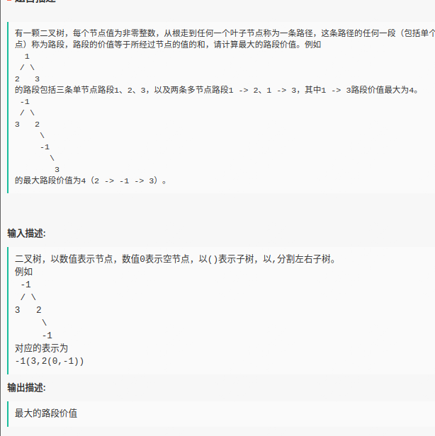
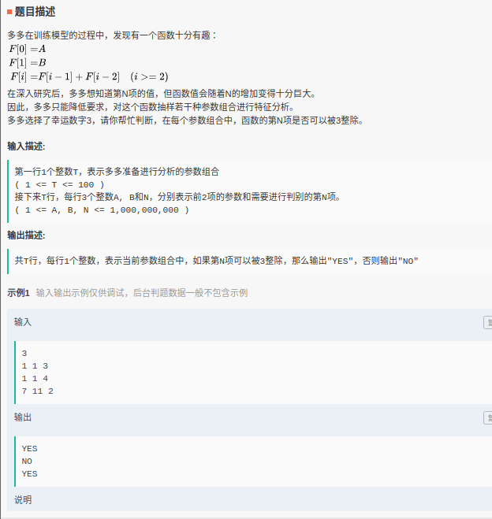
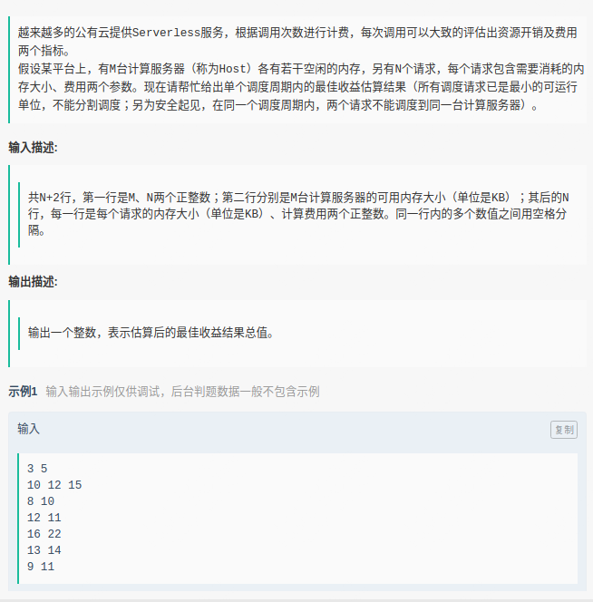

# 字符串

## 交错01串

如果一个01串任意两个相邻位置的字符都是不一样的,我们就叫这个01串为交错01串。例如: "1","10101","0101010"都是交错01串。
小易现在有一个01串s,小易想找出一个最长的**连续子串**,并且这个子串是一个交错01串。小易需要你帮帮忙求出最长的这样的子串的长度是多少。

```
输入
111101111
输出
3
```

**题解**：暴力求解，以每个字符作为开头，遍历之后交替字符，若出现非交替字符退出循环，最后取最大值即可

```C++
string s;
int main() {
    cin >> s;
    
    int max_cnt = 0;
    for(int j = 0; j < s.size(); j++) {
        int cnt = 0;
        for(int i = j; i < s.size() - 1; i++) {
            if(s[i] != s[i+1]) cnt++;
            else break;
        }
        max_cnt = max(max_cnt, cnt);
    }
    cout << max_cnt + 1;
    return 0;
}
```


## 01交替

给定一个 01 串，我们 “交替子序列” 为这个串的一个不连续子序列，它满足任意的两个相邻的数字不相等。现在，我们要对这个 01 串的某一段**非空连续子串**进行反转操作，即将这一段上的所有 0 变为 1，所有 1 变为 0。然后，求问进行了有且仅有一次的反转操作后，求该串的最长交替子序列的长度。

[**题解**](https://www.cnblogs.com/dilthey/p/10473359.html)：首先，对于一个 01 串，对其进行压缩操作，即将所有连续的相同的数字压缩成一个数字，例如将 10110011 可以压缩成 10101，然后得到的这个新的串就是一个交替子序列，并且是最长的那个。

而且不难发现，对于任何 01 串，一次反转操作，可以使其最长交替子序列的长度增加 0,1,2：

1、本身就是一个交替子序列，增加 0。

2、包含一个“00”或者“11”，能增加 1。

3、包含超过一个的“00”或者“11”，能增加 2（注意这种情况，两个“00”重叠在一起得到“000”也算）。

换句话说，我们只要统计所有满足 `s[i]=s[i+1](i∈[1,n−1])` 的 i 的个数就能知道有多少个“00”或者“11”。

```
输入
8
10000011
输出
5

输入
2
01
输出
2
```


```C++
int n;
string s;
int main()
{
    cin >> n >> s;

    int cnt=0;
    for(int i = 0; i < n-1; i++) if(s[i] == s[i+1]) cnt++;

    int res = 1, now = s[0];
    for(int i = 1; i < n; i++) if(s[i] != now) res++, now = s[i];

    if(cnt >= 2) cout << res+2 <<endl;
    else if(cnt == 1) cout << res+1 <<endl;
    else cout << res <<endl;
    return 0;
}
```


# 二叉树

## 二叉树的最大路段和



```
输入
-1(3, 2)
输出
3
```


```C++
#include <iostream>
#include <vector>
#include <queue>
#include <stack>
#include <string>

using namespace std;

struct TreeNode{
    int val;
    TreeNode *left, *right;
    TreeNode(int x) : val(x), left(NULL), right(NULL) {};
};

int str2int(string s) {
    return atoi(s.c_str());
}


//将字符串转换为树结构
TreeNode* createTree(string str){
    stack<TreeNode*> stk;
    bool dircFlag=true;

    //临时变量
    int length=str.size();
    
    string val;
    int first_left;
    for(int i = 0; i < length; i++) {
        if(str[i] == '(') {
            val = str.substr(0, i);
            first_left = i;
            // cout << val;
            break;
        }
    }
    // exit(0);
    
    
    TreeNode* node = new TreeNode(str2int(val));
    stk.push(node);
    //保存根结点位置
    TreeNode* root = node;

    char cur;
    int last = first_left + 1; // 上一个符号的位置
    for(int i = first_left + 1; i < length; i++) {
        if(str[i] == '(' || str[i] == ',' || str[i] == ')') {
            string val = str.substr(last, i - last + 1);
            cout << val << endl;
            last = i + 1; // 存储上一个符号位置
        }
        // cur = str[i];
        // //当前字符的四种情况
        // if(cur == '(') {
        //     // stk.push(node);
        //     dircFlag = true;
        //     lablePos = i;
        // }
        // else if(cur == ')') {
        //     // stk.pop();
        //     dircFlag = false;
        //     lablePos = i;
        // }
        // else if(cur == ',') {
        //     dircFlag = false;
        //     lablePos = i;
        // }
        // else if{
        //     printf("%s", curVal);
        //     node = new TreeNode(curVal);
        //     if(dircFlag){
        //         stk.top()->left = node;
        //     }
        //     else{
        //         stk.top()->right = node;
        //     }
        // }
    }
    return root;
}

void preOrder(TreeNode *root) {
    if(!root) return;
    printf("%d ", root->val);
    preOrder(root->left);
    preOrder(root->right);
}

int main() {
    string s;
    cin >> s;
    // cout << s << endl;
    TreeNode* root = createTree(s);
    // preOrder(root);
    return 0;
}
```


# 数学

## 斐波那契数列中能被3整除的项



f(0) = A; f(1) = B; f(i) = f(i-1)+f(i-2)  求函数的第 N 项是否能被3整除，N <= 1e9

```
输入
3
1 1 3
1 1 4
7 11 2
输出
YES
NO
YES
```

我的解答（AC 80%）：

```C++
int first, second;
long long f(int x) {
    if(x == 0) return first;
    if(x == 1) return second;
    return f(x-2) + f(x-1);
}

int main()
{
    int N;
    cin >> N;
    while(N--) {
        int n;
        cin >> first >> second >> n;
        
        int diff;
        for(int i = 0; i < 4; i++) {
            // cout << i << ": " << f(i) << " " << (f(i) % 3) << endl;
            if(f(i) % 3 == 0) {
                diff = i;
                break;
            }
        }
        
        if(n % 4 == diff) cout << "YES" << endl;
        else cout << "NO" << endl;
    }
    return 0;
}
```


AC解答：

```C++
int n,A,B,N,i=0;
int main(){
    cin>>n;
    while(i<n){
        i++;
        cin>>A>>B>>N;
        int t=N%4;
        if(t==0) {
            if(A%3==0)printf("YES\n");
            else printf("NO\n");
        }
        else if(t==1) {
            if(B%3==0)printf("YES\n");
            else printf("NO\n");
        }
        else if(t==2){
            if(((A%3+B%3))%3==0)printf("YES\n");
            else printf("NO\n");
        }
        else
        {
            if(((A%3+2*(B%3)))%3==0)printf("YES\n");
            else printf("NO\n");
        }
    }
    return 0;
}
```


# 贪心

## 服务器的最大收益



输入

```
输入
3 5
10 12 15
8 10
12 11
16 22
13 14
9 11
输出
36
```


题解：

[类似题目](https://blog.csdn.net/alxe_made/article/details/96477010)

```

```

